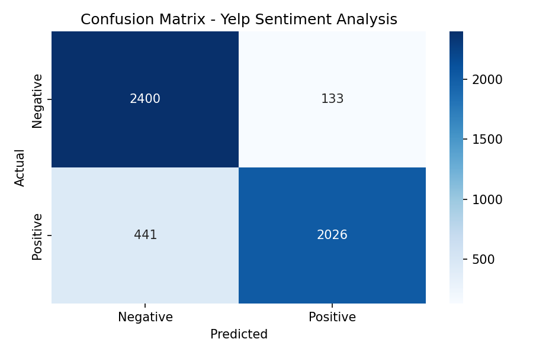
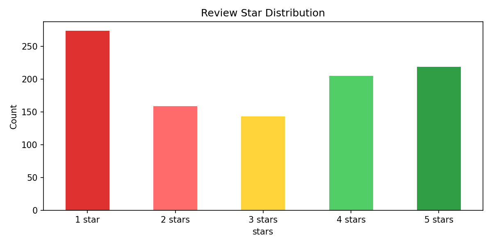

# Yelp Restaurant Review Sentiment Analyzer

A machine learning pipeline that analyzes customer reviews and generates actionable business insights using NLP and Generative AI.

## Business Value
- Automatically classify thousands of customer reviews in seconds
- Generate specific business recommendations using AI
- Help restaurant managers prioritize improvements based on customer feedback

## Results
- **88.52% accuracy** on 5,000 Yelp reviews
- **94% precision** on positive reviews
- **95% recall** on negative reviews

## Confusion Matrix


## Star Distribution


## Tech Stack
- **DistilBERT** — Pre-trained transformer model for sentiment analysis
- **Groq + LLaMA 3** — Generative AI for business insights
- **Streamlit** — Interactive web application
- **Hugging Face Datasets** — Yelp polarity dataset

## How It Works
1. User inputs a customer review
2. DistilBERT classifies sentiment (positive/negative) with confidence score
3. Groq AI generates a 2-3 sentence business recommendation
4. Results displayed in an interactive dashboard

## How to Run
```bash
pip install transformers groq streamlit python-dotenv datasets
```
Create a `.env` file with your Groq API key:
```
groq_api_key=your_key_here
```
Run the app:
```bash
streamlit run app.py
```

## Sample Output
- **Negative review** → "The food was cold and service was slow" → 100% NEGATIVE + recommendation to improve service training
- **Positive review** → "Amazing food and staff" → 100% POSITIVE + recommendation to reward staff
